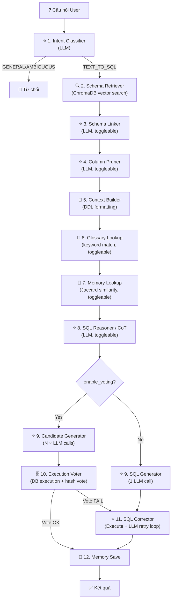

# 📋 Phân Tích Pipeline Architecture — Mini Wren AI

## 1. Tổng Quan Kiến Trúc

Mini Wren AI sử dụng kiến trúc **12-step pipeline** để chuyển đổi câu hỏi tự nhiên thành SQL và thực thi trên SQL Server.

```
question → [1] Intent → [2] Retrieve → [3] Schema Link → [4] Column Prune
  → [5] Context Build → [6] Glossary → [7] Memory → [8] CoT Reasoning
  → [9+10] Multi-Candidate Generate + Vote → [11] Correct → [12] Memory Save
  → result
```

### Phân loại theo khả năng bật/tắt

| Loại | Nodes | Ghi chú |
|------|-------|---------|
| **Luôn chạy** (core) | Intent, Retrieve, Context Build, SQL Generate/Correct, SQL Rewrite | Bắt buộc cho pipeline hoạt động |
| **Bật/tắt được** (toggleable) | Schema Linking, Column Pruning, CoT Reasoning, Voting, Glossary, Memory | Qua request body hoặc config |

---

## 2. Hai Pipeline Chính

### 2.1 Deploy Pipeline

**File**: `src/pipelines/deploy_pipeline.py`

Chạy **1 lần** khi server khởi động. Không có LLM call.

```
models.yaml → ManifestBuilder → ManifestDeployer → SchemaIndexer → Ready
```

| Bước | Component | Mô tả |
|------|-----------|-------|
| 1 | `SQLServerConnector` | Kết nối SQL Server, khởi tạo engine |
| 2 | `SchemaIntrospector` | Đọc metadata DB (tables, columns, FKs) |
| 3 | `ManifestBuilder` | Đọc `models.yaml` + introspect → build `Manifest` object |
| 4 | `ManifestDeployer` | Lưu manifest ra file, tính hash để detect thay đổi |
| 5 | `SchemaIndexer` | Embed schema documents → index vào ChromaDB (2 collections: `db_schema`, `table_descriptions`) |

### 2.2 Ask Pipeline

**File**: `src/pipelines/ask_pipeline.py`

Chạy **mỗi câu hỏi**. Đây là pipeline chính với 12 bước.

---

## 3. Chi Tiết Từng Node

---

### Step 1: Intent Classifier ⭐ LLM CALL

| Thuộc tính | Giá trị |
|-----------|---------|
| **File** | `src/generation/intent_classifier.py` |
| **Class** | `IntentClassifier` |
| **Method** | `classify(question, model_names)` |
| **LLM Call** | ✅ **Có** — 1 lần `chat_json()` |
| **Bật/tắt** | ❌ Luôn chạy |

**Chức năng**: Phân loại câu hỏi thành 3 loại: `TEXT_TO_SQL`, `GENERAL`, `AMBIGUOUS`. Chặn sớm câu hỏi không liên quan, tránh lãng phí LLM calls ở các bước sau.

#### Input chi tiết

| Tham số | Kiểu | Ví dụ |
|---------|------|-------|
| `question` | `str` | `"Top 5 khách hàng mua nhiều hàng nhất?"` |
| `model_names` | `list[str]` | `["internet_sales", "customers", "products", "geography"]` |

LLM nhận system prompt chứa danh sách model names + user prompt là câu hỏi.

#### Output chi tiết

```python
@dataclass
class IntentResult:
    intent: Intent       # enum: TEXT_TO_SQL | GENERAL | AMBIGUOUS
    reason: str          # "Câu hỏi yêu cầu truy vấn top khách hàng theo doanh số"
```

**Ví dụ output**:
```json
{"intent": "TEXT_TO_SQL", "reason": "Câu hỏi yêu cầu truy vấn top 5 khách hàng"}
```

**Luồng điều kiện**: Nếu `GENERAL` hoặc `AMBIGUOUS` → pipeline dừng ngay, trả `AskResult` với error message.

---

### Step 2: Schema Retriever 🔍 VECTOR SEARCH

| Thuộc tính | Giá trị |
|-----------|---------|
| **File** | `src/retrieval/schema_retriever.py` |
| **Class** | `SchemaRetriever` |
| **Method** | `retrieve(query, top_k=5)` |
| **LLM Call** | ❌ **Không** — dùng vector search (ChromaDB) |
| **Bật/tắt** | ❌ Luôn chạy |

**Chức năng**: Tìm tables/columns liên quan đến câu hỏi bằng embedding similarity, sau đó kéo thêm related tables qua relationships.

#### Input chi tiết

| Tham số | Kiểu | Ví dụ |
|---------|------|-------|
| `query` | `str` | `"Top 5 khách hàng mua nhiều hàng nhất?"` |
| `top_k` | `int` | `5` (mặc định) |
| `expand_relationships` | `bool` | `True` |

#### Output chi tiết

```python
@dataclass
class RetrievalResult:
    query: str                        # Câu hỏi gốc
    model_names: list[str]            # Sau expansion: ["internet_sales", "customers", "products"]
    expanded_from: list[str]          # Trước expansion: ["internet_sales", "customers"]
    db_schemas: list[dict[str, Any]]  # Full schema dicts
    raw_documents: list[dict]         # Raw ChromaDB documents
```

**`db_schemas` mỗi phần tử có dạng:**
```python
{
    "type": "TABLE",
    "name": "internet_sales",            # model name
    "comment": "/* {'alias': ...} */",
    "columns": [
        {
            "type": "COLUMN",
            "name": "SalesOrderNumber",
            "data_type": "string",
            "is_primary_key": True,
            "comment": "-- {'alias': 'Mã đơn hàng', 'description': '...'}"
        },
        {
            "type": "COLUMN",
            "name": "SalesAmount",
            "data_type": "decimal",
            ...
        },
        {
            "type": "FOREIGN_KEY",
            "constraint": "FOREIGN KEY (CustomerKey) REFERENCES customers(CustomerKey)",
            "tables": ["internet_sales", "customers"]
        }
    ]
}
```

**3 bước nội bộ**:
1. **Table Retrieval**: Embed câu hỏi → vector search `table_descriptions` → top-K model names
2. **Relationship Expansion**: Kéo thêm related models 1-hop. VD: `internet_sales` → kéo thêm `customers`, `products`
3. **Schema Retrieval**: Fetch TABLE + TABLE_COLUMNS docs từ `db_schema` collection

---

### Step 3: Schema Linker ⭐ LLM CALL

| Thuộc tính | Giá trị |
|-----------|---------|
| **File** | `src/retrieval/schema_linker.py` |
| **Class** | `SchemaLinker` |
| **Method** | `link(question, ddl_context)` |
| **LLM Call** | ✅ **Có** — 1 lần `chat_json()` |
| **Bật/tắt** | ✅ `enable_schema_linking` |

**Chức năng**: Map explicitly các entity/value trong câu hỏi → table.column cụ thể. Output dùng làm context hints cho SQL generation.

**Inspired by**: DIN-SQL, CHESS, RSL-SQL

#### Input chi tiết

| Tham số | Kiểu | Ví dụ |
|---------|------|-------|
| `question` | `str` | `"Top 5 khách hàng mua nhiều hàng nhất?"` |
| `ddl_context` | `str` | DDL preview text từ ContextBuilder (chạy phụ trước bước này) |

LLM nhận DDL + câu hỏi, trả JSON mapping.

#### Output chi tiết

```python
@dataclass
class EntityLink:
    mention: str         # "khách hàng"
    table: str           # "customers"
    column: str          # "*" (toàn bộ table) hoặc "FirstName"
    confidence: float    # 0.95

@dataclass
class ValueLink:
    mention: str         # "Hà Nội"
    table: str           # "geography"
    column: str          # "City"
    value: str           # "Hà Nội"
    operator: str        # "="

@dataclass
class SchemaLinkResult:
    entity_links: list[EntityLink]      # [EntityLink("khách hàng", "customers", "*", 1.0)]
    value_links: list[ValueLink]        # [ValueLink("Hà Nội", "geography", "City", "Hà Nội", "=")]
    linked_tables: list[str]            # ["customers", "geography"]
    linked_columns: list[str]           # ["geography.City"]
    ambiguities: list[str]              # ["doanh thu có thể là SalesAmount hoặc TotalProductCost"]
    context_hints: str                  # Text block inject vào prompt
```

**`context_hints` output ví dụ:**
```
### SCHEMA LINKING ###
- "khách hàng" → table customers
- "mua nhiều" → internet_sales.SalesAmount

### VALUE FILTERS ###
- "Hà Nội" → geography.City = 'Hà Nội'
```

---

### Step 4: Column Pruner ⭐ LLM CALL

| Thuộc tính | Giá trị |
|-----------|---------|
| **File** | `src/retrieval/column_pruner.py` |
| **Class** | `ColumnPruner` |
| **Method** | `prune(question, db_schemas, min_columns=3)` |
| **LLM Call** | ✅ **Có** — 1 lần `chat_json()` (skip nếu tổng columns ≤ 15) |
| **Bật/tắt** | ✅ `enable_column_pruning` |

**Chức năng**: Loại bỏ columns không liên quan → giảm token cost, tăng accuracy. LLM chọn columns cần thiết, nhưng luôn giữ PK/FK.

**Inspired by**: CHESS Schema Selector, X-Linking

#### Input chi tiết

| Tham số | Kiểu | Ví dụ |
|---------|------|-------|
| `question` | `str` | `"Top 5 khách hàng mua nhiều hàng nhất?"` |
| `db_schemas` | `list[dict]` | Full db_schemas từ Step 2 (chứa tất cả columns) |
| `min_columns` | `int` | `3` — giữ tối thiểu 3 columns/table |

LLM nhận schema summary text:
```
## Table: internet_sales
  - SalesOrderNumber string (PK) — Mã đơn hàng
  - SalesAmount decimal — Số tiền bán
  - OrderQuantity integer — Số lượng
  - TaxAmt decimal — Thuế
  - Freight decimal — Phí vận chuyển
  ...
```

#### Output chi tiết

| Output | Kiểu | Ví dụ |
|--------|------|-------|
| `pruned_schemas` | `list[dict]` | Giống `db_schemas` nhưng columns đã được lọc |

**LLM trả JSON:**
```json
{
    "selected_columns": {
        "internet_sales": ["SalesOrderNumber", "SalesAmount", "CustomerKey"],
        "customers": ["CustomerKey", "FirstName", "LastName"]
    }
}
```

**Logic apply pruning:**
1. Giữ tất cả columns được LLM chọn
2. **Luôn giữ** PK columns (dù LLM không chọn)
3. **Luôn giữ** FK constraints
4. Đảm bảo mỗi table ≥ `min_columns`
5. Table không nằm trong `selected_columns` → giữ nguyên tất cả columns

**Auto-skip**: Nếu tổng columns ≤ 15 → trả original db_schemas, không gọi LLM.

---

### Step 5: Context Builder 🔧 LOGIC ONLY

| Thuộc tính | Giá trị |
|-----------|---------|
| **File** | `src/retrieval/context_builder.py` |
| **Class** | `ContextBuilder` |
| **Method** | `build(db_schemas, model_names)` |
| **LLM Call** | ❌ **Không** — pure string formatting |
| **Bật/tắt** | ❌ Luôn chạy |

**Chức năng**: Chuyển đổi db_schemas thành DDL text string. Đây là **input chính** cho tất cả LLM bước sau (generation, reasoning, correction).

#### Input chi tiết

| Tham số | Kiểu | Ví dụ |
|---------|------|-------|
| `db_schemas` | `list[dict]` | Pruned schemas từ Step 4 |
| `model_names` | `list[str]` | `["internet_sales", "customers"]` — dùng để filter FK relationships |

#### Output chi tiết

| Output | Kiểu | Ví dụ |
|--------|------|-------|
| `ddl` | `str` | CREATE TABLE DDL text (xem bên dưới) |

**DDL output ví dụ:**
```sql
/* {'alias': 'internet_sales', 'description': 'Bảng dữ liệu bán hàng qua internet'} */
CREATE TABLE internet_sales (
  -- {'alias': 'Mã đơn hàng', 'description': 'Mã đơn hàng (PK)'}
  SalesOrderNumber VARCHAR PRIMARY KEY,
  -- {'alias': 'Số tiền bán', 'description': 'Tổng tiền bán hàng'}
  SalesAmount DECIMAL,
  -- {'condition': 'internet_sales.CustomerKey = customers.CustomerKey', 'joinType': 'many_to_one'}
  FOREIGN KEY (CustomerKey) REFERENCES customers(CustomerKey)
);

/* {'alias': 'customers', 'description': 'Thông tin khách hàng'} */
CREATE TABLE customers (
  CustomerKey INTEGER PRIMARY KEY,
  FirstName VARCHAR,
  LastName VARCHAR
);

-- Relationships:
-- internet_sales.CustomerKey = customers.CustomerKey (many_to_one)
```

**Lưu ý quan trọng**: DDL dùng **model names** (`customers`) chứ không dùng tên DB thật (`dbo.DimCustomer`). SQL Rewriter ở Step 11 xử lý việc convert.

---

### Step 6: Business Glossary 📖 LOGIC ONLY

| Thuộc tính | Giá trị |
|-----------|---------|
| **File** | `src/retrieval/business_glossary.py` |
| **Class** | `BusinessGlossary` |
| **Methods** | `lookup(question)` → matches, `build_context(matches)` → text |
| **LLM Call** | ❌ **Không** — keyword matching (string `in` operator) |
| **Bật/tắt** | ✅ `enable_glossary` |
| **Data source** | `glossary.yaml` (load 1 lần khi khởi tạo) |

**Chức năng**: Map thuật ngữ nghiệp vụ → SQL concepts. Giải quyết ambiguity ("doanh thu" → cột nào?) và cung cấp business logic.

#### Input chi tiết

| Tham số | Kiểu | Ví dụ |
|---------|------|-------|
| `question` | `str` | `"Top 5 khách hàng mua nhiều hàng nhất?"` |

**Glossary YAML ví dụ** (`glossary.yaml`):
```yaml
terms:
  - name: "doanh thu"
    aliases: ["revenue", "sales", "tổng doanh thu", "doanh số"]
    sql_hint: "SUM(internet_sales.SalesAmount)"
    tables: ["internet_sales"]
    description: "Tổng giá trị bán hàng"
  - name: "khách hàng VIP"
    aliases: ["VIP customer"]
    sql_hint: "WHERE TotalPurchaseAmount > 1000000"
    tables: ["customers"]
```

**Cách matching**: Scan câu hỏi (lowercase) tìm keyword matches. Longest match first để tránh match con.

#### Output chi tiết

```python
@dataclass
class GlossaryTerm:
    name: str               # "doanh thu"
    aliases: list[str]      # ["revenue", "sales", ...]
    sql_hint: str           # "SUM(internet_sales.SalesAmount)"
    tables: list[str]       # ["internet_sales"]
    description: str        # "Tổng giá trị bán hàng"

@dataclass
class GlossaryMatch:
    term: GlossaryTerm      # Term object đầy đủ
    matched_keyword: str    # "khách hàng" — từ khóa match được
```

**`build_context()` output ví dụ:**
```
### BUSINESS GLOSSARY ###
- "doanh thu":
  Description: Tổng giá trị bán hàng
  SQL hint: SUM(internet_sales.SalesAmount)
  Tables: internet_sales
```

Context này được **prepend** vào DDL context: `glossary_context + "\n\n" + ddl`.

---

### Step 7: Semantic Memory Lookup 🧠 LOGIC ONLY

| Thuộc tính | Giá trị |
|-----------|---------|
| **File** | `src/generation/semantic_memory.py` |
| **Class** | `SemanticMemory` |
| **Methods** | `find_similar(question)` → traces, `build_context(traces)` → text |
| **LLM Call** | ❌ **Không** — keyword-based Jaccard similarity |
| **Bật/tắt** | ✅ `enable_memory` |
| **Data source** | `semantic_memory.json` (load + save liên tục) |

**Chức năng**: Tìm câu hỏi tương tự đã xử lý thành công trước đó → inject SQL mẫu vào prompt (few-shot learning).

#### Input chi tiết

| Tham số | Kiểu | Ví dụ |
|---------|------|-------|
| `question` | `str` | `"Top 5 khách hàng mua nhiều hàng nhất?"` |
| `max_results` | `int` | `3` (mặc định) |

**Similarity algorithm**: Jaccard similarity trên word set.
```python
question_words = {"top", "5", "khách", "hàng", "mua", "nhiều", "nhất"}
trace_words    = {"top", "10", "khách", "hàng", "theo", "doanh", "thu"}
intersection   = {"top", "khách", "hàng"}
score          = 3 / 11 = 0.27  # < 0.3 threshold → không match
```

Chỉ trả traces có `success=True` và Jaccard score > 0.3.

#### Output chi tiết

```python
@dataclass
class ExecutionTrace:
    question: str           # "Tổng doanh thu theo khách hàng"
    sql: str                # "SELECT c.FirstName, SUM(s.SalesAmount)..."
    success: bool           # True
    result_hash: str        # "a1b2c3d4..."
    error: str              # "" (empty if success)
    timestamp: str          # "2026-03-19T22:30:00"
    models_used: list[str]  # ["internet_sales", "customers"]
    retries: int            # 0
```

**`build_context()` output ví dụ:**
```
### CÂU HỎI TƯƠNG TỰ TRƯỚC ĐÂY ###
Q: Tổng doanh thu theo khách hàng
SQL: SELECT c.FirstName, SUM(s.SalesAmount) FROM internet_sales s JOIN customers c ON ...

Q: Top 10 sản phẩm bán chạy nhất
SQL: SELECT TOP 10 p.ProductName, SUM(s.OrderQuantity) FROM ...
```

Context này được **prepend** vào DDL context: `memory_context + "\n\n" + ddl`.

---

### Step 8: SQL Reasoner ⭐ LLM CALL

| Thuộc tính | Giá trị |
|-----------|---------|
| **File** | `src/generation/sql_reasoner.py` |
| **Class** | `SQLReasoner` |
| **Method** | `reason(question, ddl_context)` |
| **LLM Call** | ✅ **Có** — 1 lần `chat_json()` |
| **Bật/tắt** | ✅ `enable_cot_reasoning` |

**Chức năng**: Chain-of-Thought reasoning — phân tích câu hỏi thành kế hoạch truy vấn chi tiết trước khi sinh SQL.

**Inspired by**: DIN-SQL, SQL-of-Thought, STaR-SQL

#### Input chi tiết

| Tham số | Kiểu | Ví dụ |
|---------|------|-------|
| `question` | `str` | `"Top 5 khách hàng mua nhiều hàng nhất?"` |
| `ddl_context` | `str` | DDL text từ Step 5 (đã enriched với glossary + memory) |

#### Output chi tiết

```python
@dataclass
class ReasoningResult:
    steps: list[str]            # ["Bước 1: Tìm khách hàng từ bảng customers", ...]
    tables_needed: list[str]    # ["internet_sales", "customers"]
    columns_needed: list[str]   # ["internet_sales.SalesAmount", "customers.FirstName"]
    aggregations: list[str]     # ["SUM(internet_sales.SalesAmount)"]
    filters: list[str]          # []
    grouping: list[str]         # ["customers.CustomerKey"]
    ordering: str               # "DESC"
    reasoning_text: str         # Full text cho prompt injection (xem bên dưới)
```

**`reasoning_text` output ví dụ:**
```
### KẾ HOẠCH TRUY VẤN ###
- Bước 1: JOIN internet_sales với customers qua CustomerKey
- Bước 2: GROUP BY khách hàng
- Bước 3: SUM(SalesAmount) cho mỗi khách hàng
- Bước 4: ORDER BY DESC và lấy TOP 5

Tables cần dùng: internet_sales, customers
Columns cần dùng: internet_sales.SalesAmount, customers.FirstName, customers.LastName
Aggregations: SUM(internet_sales.SalesAmount)
Group by: customers.CustomerKey, customers.FirstName, customers.LastName
Order: DESC
```

`reasoning_text` inject vào prompt SQL generation → LLM sinh SQL theo plan.

---

### Step 9+10: Candidate Generator + Execution Voter

#### Step 9: Candidate Generator ⭐ LLM CALL (×N)

| Thuộc tính | Giá trị |
|-----------|---------|
| **File** | `src/generation/candidate_generator.py` |
| **Class** | `CandidateGenerator` |
| **Method** | `generate(question, ddl_context, reasoning_plan, schema_hints)` |
| **LLM Call** | ✅ **Có** — **N lần** `chat_json()` (N = `num_candidates`, mặc định 3) |
| **Bật/tắt** | ✅ `enable_voting` + `num_candidates` |

**Chức năng**: Sinh **N SQL candidates** bằng các chiến lược khác nhau (varied temperature + có/không reasoning plan).

**Inspired by**: CHASE-SQL, CSC-SQL

#### Input chi tiết

| Tham số | Kiểu | Ví dụ |
|---------|------|-------|
| `question` | `str` | `"Top 5 khách hàng mua nhiều hàng nhất?"` |
| `ddl_context` | `str` | Enriched DDL (glossary + memory + DDL) |
| `reasoning_plan` | `str` | Reasoning text từ Step 8 (optional) |
| `schema_hints` | `str` | Schema linking hints từ Step 3 (optional) |

**3 chiến lược mặc định:**

| # | Strategy | Temperature | Reasoning | Prompt |
|---|----------|-------------|-----------|--------|
| 1 | `precise_with_reasoning` | 0.0 | ✅ Có | `reasoning_plan + schema_hints + ddl` |
| 2 | `balanced_with_reasoning` | 0.3 | ✅ Có | `reasoning_plan + schema_hints + ddl` |
| 3 | `creative_no_reasoning` | 0.7 | ❌ Không | `schema_hints + ddl` (bỏ reasoning) |

Mỗi strategy dùng `SQLGenerator` bên trong với temperature khác nhau.

#### Output chi tiết

```python
@dataclass
class Candidate:
    sql: str                # "SELECT TOP 5 c.FirstName, SUM(s.SalesAmount)..."
    explanation: str        # "Truy vấn top 5 khách hàng theo tổng doanh số"
    temperature: float      # 0.0
    strategy: str           # "precise_with_reasoning"
    raw_response: dict      # Raw JSON từ LLM

@dataclass
class CandidateSet:
    question: str                    # Câu hỏi gốc
    candidates: list[Candidate]     # [Candidate_0, Candidate_1, Candidate_2]
    reasoning_plan: str              # CoT plan text
```

**Nếu `enable_voting = false`**: Skip CandidateGenerator, dùng **SQLGenerator** single-pass (1 LLM call).

**SQLGenerator** (`src/generation/sql_generator.py`):
- Input: `question` + `ddl_context`
- LLM Call: ✅ 1 lần `chat_json()` (temperature 0.0)
- Output: `SQLGenerationResult(sql, explanation, raw_response)`

---

#### Step 10: Execution Voter 🗄️ DB EXECUTION

| Thuộc tính | Giá trị |
|-----------|---------|
| **File** | `src/generation/execution_voter.py` |
| **Class** | `ExecutionVoter` |
| **Method** | `vote(candidate_set)` |
| **LLM Call** | ❌ **Không** — chạy SQL trên DB thật + hash compare |
| **Bật/tắt** | ✅ cùng `enable_voting` |

**Chức năng**: Chọn SQL tốt nhất bằng execution-based voting — chạy tất cả candidates trên DB, nhóm theo kết quả, chọn majority.

#### Input chi tiết

| Tham số | Kiểu | Ví dụ |
|---------|------|-------|
| `candidate_set` | `CandidateSet` | Từ Step 9 (chứa N candidates) |

#### Xử lý nội bộ

Với mỗi candidate:
1. **Rewrite** SQL (model names → DB names) qua `SQLRewriter`
2. **Execute** trên SQL Server thật (limit 50 rows)
3. **Hash** kết quả bằng MD5: `hash(sorted_columns + rows)`

Sau khi execute tất cả:
4. **Group** candidates theo result hash
5. **Majority vote**: nhóm có nhiều candidates nhất → chiến thắng
6. Trong nhóm thắng → chọn candidate có **temperature thấp nhất**

#### Output chi tiết

```python
@dataclass
class ExecutionResult:
    candidate: Candidate          # Candidate gốc
    success: bool                 # True nếu SQL chạy được
    columns: list[str]            # ["FirstName", "TotalSales"]
    rows: list[dict]              # [{"FirstName": "John", "TotalSales": 5000}, ...]
    row_count: int                # 5
    result_hash: str              # "a1b2c3d4e5f6..."

@dataclass
class VotingResult:
    best_candidate: Candidate             # Candidate chiến thắng
    best_sql_rewritten: str               # SQL đã rewrite (DB names)
    execution_result: ExecutionResult      # Kết quả execute của candidate thắng
    total_candidates: int                 # 3
    successful_candidates: int            # 2
    voting_method: str                    # "majority" | "single_success" | "fallback"
    vote_distribution: dict[str, int]     # {"hash1": 2, "hash2": 1}
```

**Voting methods:**
- `majority` — ≥2 candidates ra cùng kết quả
- `single_success` — chỉ 1 candidate chạy được
- `single` — chỉ có 1 candidate (skip voting)
- `fallback` — không candidate nào chạy được → trả candidate đầu tiên cho correction

**Nếu voting thành công** → bỏ qua Step 11 (SQL Correction), vào thẳng Step 12.

---

### Step 11: SQL Corrector ⭐ LLM CALL (conditional)

| Thuộc tính | Giá trị |
|-----------|---------|
| **File** | `src/generation/sql_corrector.py` |
| **Class** | `SQLCorrector` |
| **Method** | `validate_and_correct(sql, ddl_context, question, explanation)` |
| **LLM Call** | ✅ **Có** — 0 đến 3 lần (retry loop) |
| **Bật/tắt** | ❌ Luôn chạy (auto-skip nếu voting thành công) |

**Chức năng**: Validate SQL trên DB thật, nếu lỗi → gửi LLM sửa → retry (max 3 lần).

#### Input chi tiết

| Tham số | Kiểu | Ví dụ |
|---------|------|-------|
| `sql` | `str` | `"SELECT TOP 5 c.FirstName, SUM(s.SalesAmount)..."` (model names) |
| `ddl_context` | `str` | Enriched DDL cho correction prompt |
| `question` | `str` | Câu hỏi gốc |
| `explanation` | `str` | Giải thích từ generator |

#### Xử lý nội bộ (retry loop)

```
attempt 0: rewrite → execute → OK? → return success (0 LLM calls)
attempt 0: rewrite → execute → ERROR → gửi LLM sửa (1 LLM call) → corrected SQL
attempt 1: rewrite → execute → OK? → return (1 LLM call total)
attempt 1: rewrite → execute → ERROR → gửi LLM sửa (2nd call)
attempt 2: execute → OK? → return (2 LLM calls total)
attempt 2: execute → ERROR → gửi LLM sửa (3rd call) → final attempt
attempt 3: execute → return result (valid or not)
```

LLM correction prompt chứa: DDL + SQL bị lỗi + error message.

#### Output chi tiết

```python
@dataclass
class CorrectionResult:
    valid: bool                       # True nếu SQL chạy thành công
    sql: str                          # SQL cuối (đã rewrite sang DB names)
    original_sql: str                 # SQL gốc (model names)
    result: dict[str, Any] | None     # {"columns": [...], "rows": [...], "row_count": N}
    explanation: str                  # Giải thích
    retries: int                      # Số lần retry (0-3)
    errors: list[str]                 # Danh sách error messages gặp phải
```

**`result` dict khi success:**
```python
{
    "columns": ["FirstName", "LastName", "TotalSales"],
    "rows": [
        {"FirstName": "John", "LastName": "Smith", "TotalSales": 50000},
        ...
    ],
    "row_count": 5
}
```

#### SQL Rewriter (sub-component) 🔧 LOGIC ONLY

| Thuộc tính | Giá trị |
|-----------|---------|
| **File** | `src/generation/sql_rewriter.py` |
| **Class** | `SQLRewriter` |
| **Method** | `rewrite(sql)` |
| **LLM Call** | ❌ — regex replacement |

**Chức năng**: Convert model names → DB table names trong SQL.
```
Input:  SELECT customers.FirstName FROM customers
Output: SELECT [dbo].[DimCustomer].FirstName FROM [dbo].[DimCustomer]
```

Mapping từ manifest: `{"customers": "dbo.DimCustomer", "internet_sales": "dbo.FactInternetSales"}`.
Sort by name length DESC để tránh partial replacement (`product_subcategories` trước `products`).

---

### Step 12: Memory Save 🧠 LOGIC ONLY

| Thuộc tính | Giá trị |
|-----------|---------|
| **File** | `src/generation/semantic_memory.py` |
| **Class** | `SemanticMemory` |
| **Method** | `save_trace(question, sql, success, result_hash, models_used, error, retries)` |
| **LLM Call** | ❌ **Không** — write JSON file |
| **Bật/tắt** | ✅ `enable_memory` |

#### Input chi tiết

| Tham số | Kiểu | Ví dụ |
|---------|------|-------|
| `question` | `str` | `"Top 5 khách hàng mua nhiều hàng nhất?"` |
| `sql` | `str` | SQL cuối cùng |
| `success` | `bool` | `True` |
| `result_hash` | `str` | MD5 hash kết quả |
| `models_used` | `list[str]` | `["internet_sales", "customers"]` |
| `error` | `str` | `""` (empty nếu success) |
| `retries` | `int` | `0` |

#### Output

Append `ExecutionTrace` vào `semantic_memory.json`. Giữ tối đa **500 traces** mới nhất.

---

## 4. Tổng Hợp LLM Calls

| Step | Node | LLM? | Số calls | Có thể skip? |
|------|------|------|----------|--------------|
| 1 | Intent Classifier | ✅ | 1 | ❌ luôn chạy |
| 2 | Schema Retriever | ❌ | 0 | ❌ luôn chạy |
| 3 | Schema Linker | ✅ | 1 | ✅ `enable_schema_linking` |
| 4 | Column Pruner | ✅ | 0–1 | ✅ `enable_column_pruning` |
| 5 | Context Builder | ❌ | 0 | ❌ luôn chạy |
| 6 | Business Glossary | ❌ | 0 | ✅ `enable_glossary` |
| 7 | Semantic Memory Lookup | ❌ | 0 | ✅ `enable_memory` |
| 8 | SQL Reasoner | ✅ | 1 | ✅ `enable_cot_reasoning` |
| 9 | Candidate Generator | ✅ | 1–5 | ✅ `enable_voting` |
| 10 | Execution Voter | ❌ | 0 | ✅ cùng voting |
| 11 | SQL Corrector | ✅ | 0–3 | ❌ (auto-skip nếu vote OK) |
| 12 | Memory Save | ❌ | 0 | ✅ `enable_memory` |

### Scenarios LLM call count

| Scenario | Tổng LLM calls | Mô tả |
|----------|----------------|-------|
| **Minimum** (tất cả tắt, no error) | **2** | Intent(1) + SQLGenerator(1) |
| **Typical** (voting 3 candidates, vote OK) | **7** | Intent(1) + SchemaLink(1) + Prune(1) + Reason(1) + Candidates(3) |
| **Maximum** (tất cả bật, 5 candidates, 3 retries) | **12** | Intent(1) + SchemaLink(1) + Prune(1) + Reason(1) + Candidates(5) + Correction(3) |

---

## 5. Sơ Đồ Luồng Dữ Liệu



---

## 6. Infrastructure Components

### LLM Client

| Thuộc tính | Giá trị |
|-----------|---------|
| **File** | `src/generation/llm_client.py` |
| **Model mặc định** | `openai/gpt-4.1-mini` |
| **API** | OpenAI-compatible (configurable base_url) |
| **Methods** | `chat()` → raw text, `chat_json()` → parsed JSON |

### Indexing Layer

| Component | File | Mô tả |
|-----------|------|-------|
| `HuggingFaceEmbedder` | `src/indexing/embedder.py` | Gọi HuggingFace API để embed text |
| `VectorStore` | `src/indexing/vector_store.py` | Wrapper ChromaDB collections |
| `SchemaIndexer` | `src/indexing/schema_indexer.py` | Index manifest → 2 collections: `db_schema` + `table_descriptions` |

### Connectors

| Component | File | Mô tả |
|-----------|------|-------|
| `SQLServerConnector` | `src/connectors/connection.py` | SQLAlchemy engine cho SQL Server qua pyodbc |
| `SchemaIntrospector` | `src/connectors/schema_introspector.py` | Đọc metadata DB (tables, columns, FKs, data types) |

### Modeling

| Component | File | Mô tả |
|-----------|------|-------|
| `Manifest`, `Model`, `Column`, `Relationship` | `src/modeling/mdl_schema.py` | Data classes cho schema MDL |
| `ManifestBuilder` | `src/modeling/manifest_builder.py` | Đọc `models.yaml` + introspect → build Manifest |
| `ManifestDeployer` | `src/modeling/deploy.py` | Lưu manifest, tính hash, quản lý versions |
